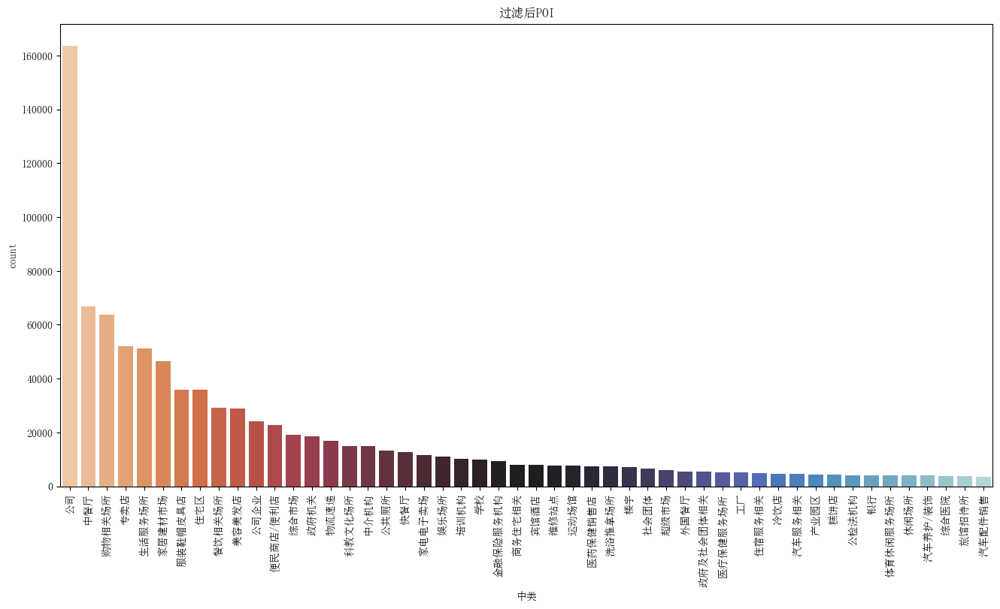

# 介绍
使用《[Sensing spatial distribution of urban land use by integrating points-of-interest and Google Word2Vec model](https://www.tandfonline.com/doi/full/10.1080/13658816.2016.1244608)》这篇文章的方法识别城市功能区。
比较经典的一篇城市功能区识别方法研究文章，整合了Word2vec模型和POI数据，提高了城市功能区识别精度。
- 以往的方法可能会忽略可从 POI 中提取的丰富空间特征。在本研究中，我们建立了一个创新框架，通过整合百度 POI 和 Word2Vec 模型，在交通分析区（TAZ）尺度上检测城市土地利用分布。
- 缺乏标注数据，我只进行了聚类分析。

# 数据集
数据集来自上海：
- 2020年高德POI
- 2024年OSM路网

# 实验

## 预处理

- poi数量分布

 

- poi空间分布

 

- road缓冲区

 

- taz

 

- k-means

 

 

 